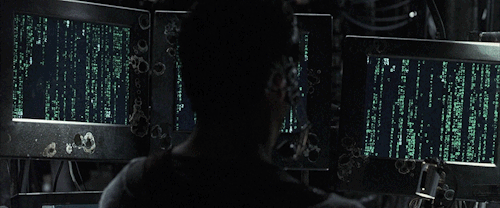

# A.K.A. Gabriel Borba - **`Desenvolvedor FullStack`**

    

 

Olá meu nome é Gabriel Borba, tenho 20 anos e sou Carioca. Atualmente, estou cursando Engenharia de Software na UniBrasil Centro Universitário - CWB/PR. Eu me amarro por tecnologia e venho aqui partilhar dos meus projetos desenvolvidos durante na minha graduação.

    

---

<h3 align="center">🤖GitHub Stats</h3>

    

<h3 align="center">
⚙ Tech Stack
</h3>

  
  &nbsp;&nbsp;
  
  &nbsp;&nbsp;
  
  &nbsp;&nbsp;
  
  &nbsp;&nbsp;
  

<picture>
  <source media="(prefers-color-scheme: dark)" srcset="https://raw.githubusercontent.com/GreenStar15/GreenStar15/output/github-contribution-grid-snake-dark.svg">
  <source media="(prefers-color-scheme: light)" srcset="https://raw.githubusercontent.com/GreenStar15/GreenStar15/output/github-contribution-grid-snake.svg">
  
</picture>
